# ACADEMIC MANAGEMENT SYSTEM — FINAL SYSTEM LIFECYCLE FLOWS

> **Document Status:** 🟢 APPROVED WITH FINAL GUARDRAILS (Phase A Frozen)  
> **Companion Document:** [ACADEMIC_MANAGEMENT_SPEC.md](file:///c:/AskUrSenior/docs/ACADEMIC_MANAGEMENT_SPEC.md)  
> **Core Mandate:** Visual sequence flows and state diagrams aligned with frozen guardrails: Universal Two-Layer Pattern, Deterministic Cascading Settings, Curriculum vs Timetable separation, and Non-Destructive Reset Engine.

---

## TABLE OF FLOWS
1. [Flow 1: Admin Creates Academic Structure & Scopes](#flow-1-admin-creates-academic-structure--scopes)
2. [Flow 2: Admin Configures Semester (Official Dates & Student Personal Dates)](#flow-2-admin-configures-semester-official-dates--student-personal-dates)
3. [Flow 3: Admin Configures Curriculum (CurriculumSubject Baseline vs Student Registered)](#flow-3-admin-configures-curriculum-curriculumsubject-baseline-vs-student-registered)
4. [Flow 4: Deterministic Cascading Settings (The Most Specific Wins)](#flow-4-deterministic-cascading-settings-the-most-specific-wins)
5. [Flow 5: Lean Timetable Publishing (Draft -> Published)](#flow-5-lean-timetable-publishing-draft---published)
6. [Flow 6: Admin Publishes Official Events (Suspensions & Student Reminders)](#flow-6-admin-publishes-official-events-suspensions--student-reminders)
7. [Flow 7: Student Receives & Renders Baseline](#flow-7-student-receives--renders-baseline)
8. [Flow 8: Student Personalizes Timetable & Electives](#flow-8-student-personalizes-timetable--electives)
9. [Flow 9: Student Resets Overrides to Admin Baseline](#flow-9-student-resets-overrides-to-admin-baseline)
10. [Flow 10: Admin Modifies Baseline (Student Has No Override)](#flow-10-admin-modifies-baseline-student-has-no-override)
11. [Flow 11: Admin Modifies Baseline (Student Has Active Override — The Exact Trace)](#flow-11-admin-modifies-baseline-student-has-active-override--the-exact-trace)
12. [Flow 12: Student Changes Section / Academic Context](#flow-12-student-changes-section--academic-context)

---

### Flow 1: Admin Creates Academic Structure & Scopes

Super Admin provisions the institutional structure (Program e.g. B.E. or MCA, optional Branch, Batch, Section) and delegates scoped authority.

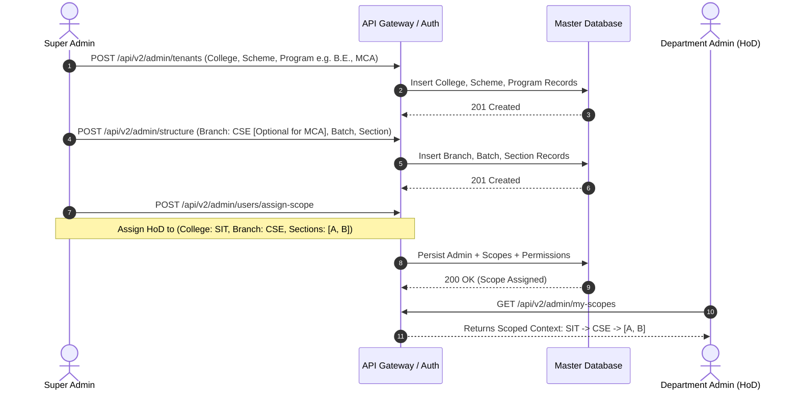

---

### Flow 2: Admin Configures Semester (Official Dates & Student Personal Dates)

Admin provisions the official term calendar. Students receive official dates and can customize their personal academic timeline without mutating official records.

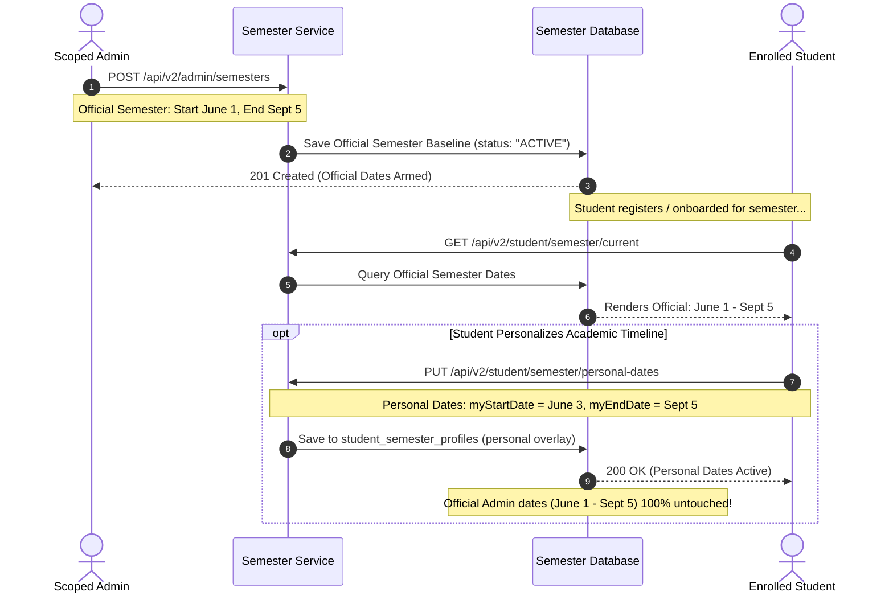

---

### Flow 3: Admin Configures Curriculum (CurriculumSubject Baseline vs Student Registered)

`CurriculumSubject` is the authoritative baseline. `StudentRegisteredSubject` is strictly the personal layer.

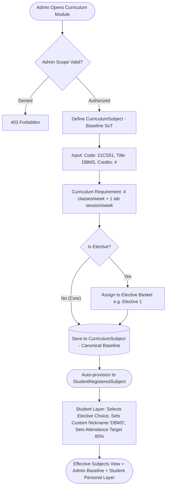

---

### Flow 4: Deterministic Cascading Settings (The Most Specific Wins)

The most specific applicable configuration wins: `Section Override > Semester Override > Branch Override > College Default`.

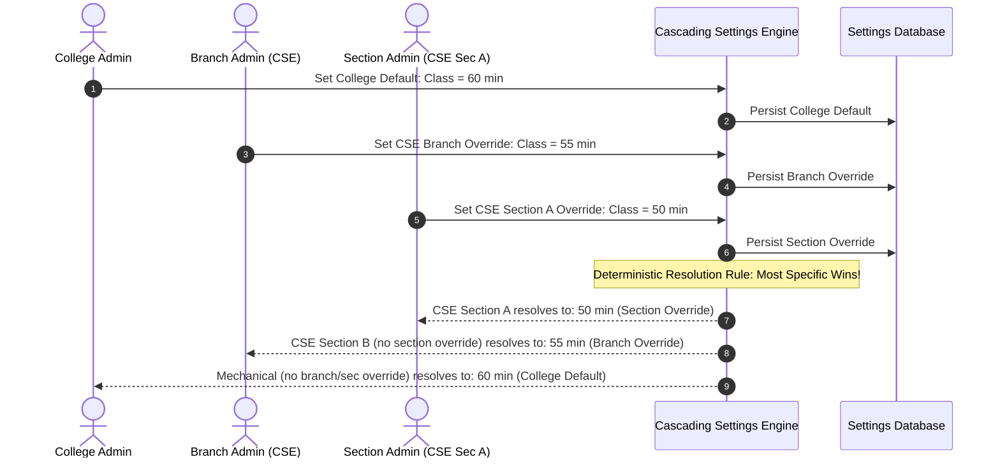

---

### Flow 5: Lean Timetable Publishing (Draft -> Published)

Timetable management with practical state transitions and publishing metadata.

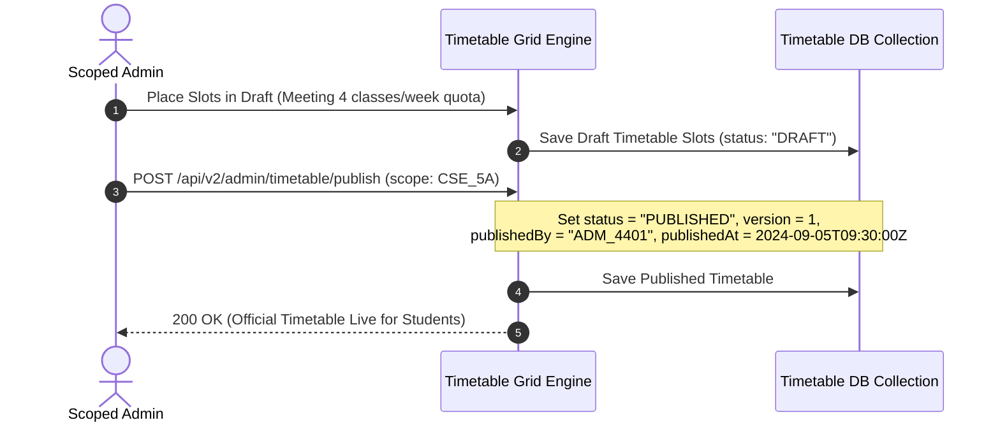

---

### Flow 6: Admin Publishes Official Events (Suspensions & Student Reminders)

Official events are authoritative and un-hideable. Students can attach personal notes and study milestones.

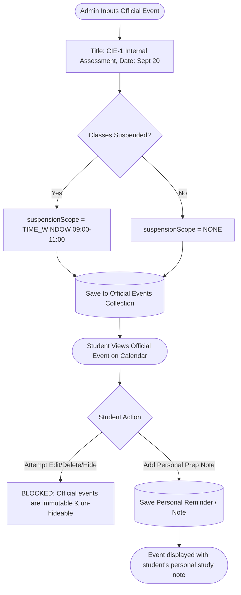

---

### Flow 7: Student Receives & Renders Baseline

Dynamic resolution combines canonical admin baseline with student personal choices.

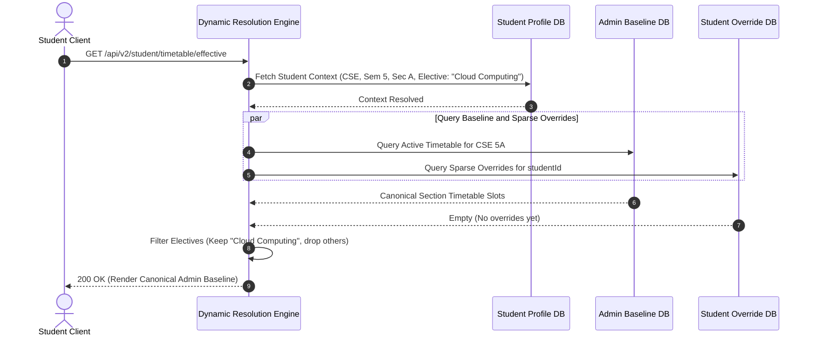

---

### Flow 8: Student Personalizes Timetable & Electives

Students customize individual slots without mutating the administrative baseline.

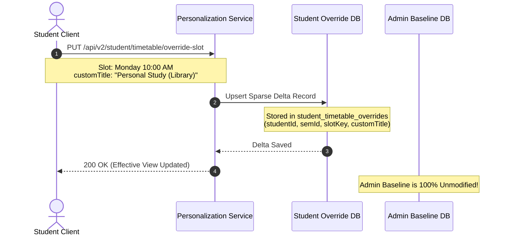

---

### Flow 9: Student Resets Overrides to Admin Baseline

Reverting local personal overrides purges the sparse delta records and immediately falls back to the canonical admin baseline.

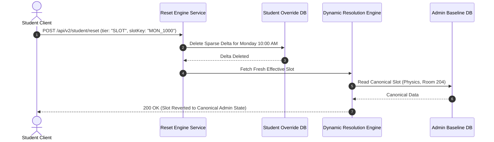

---

### Flow 10: Admin Modifies Baseline (Student Has No Override)

Admin changes instantly reflect on all un-overridden student slots in real time.

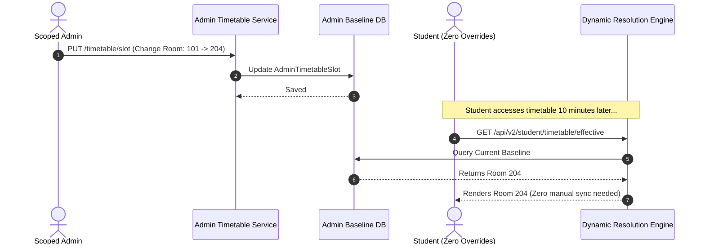

---

### Flow 11: Admin Modifies Baseline (Student Has Active Override — The Exact Trace)

**Locked Invariant:** Admin changes NEVER destroy student customizations. Overrides persist until student triggers Reset.

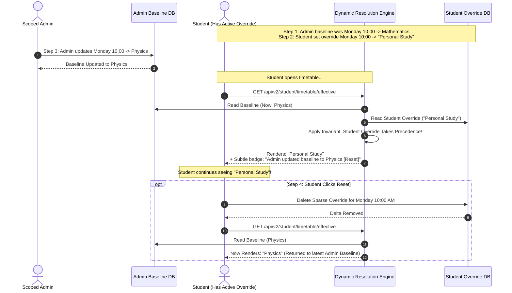

---

### Flow 12: Student Changes Section / Academic Context

Re-binding academic baseline upon cohort transfers.

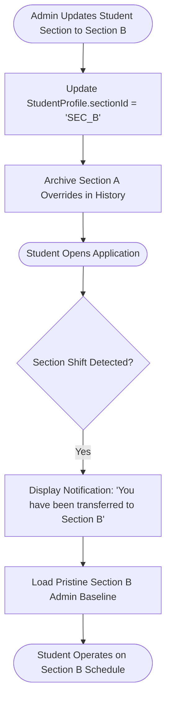
