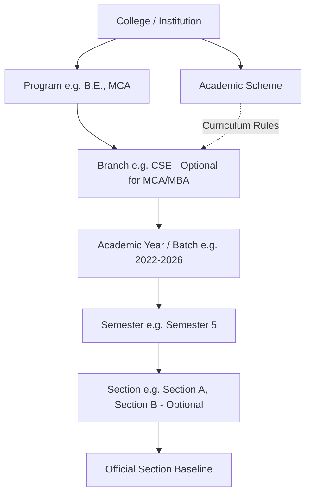

# ACADEMIC MANAGEMENT SYSTEM — FINAL ARCHITECTURAL SPECIFICATION

> **Document Status:** 🟢 APPROVED WITH FINAL GUARDRAILS (Phase A Frozen)  
> **Target Version:** 2.0 (Redesign)  
> **Core Mandate:** Reduce manual work for students. Practical, lean architecture without ERP bloat. Universal Two-Layer Model (Admin Baseline + Student Personal Layer). Strict server-side scoping.

---

## TABLE OF CONTENTS
1. [Product Goals & System Philosophy](#1-product-goals--system-philosophy)
2. [The Universal Two-Layer Pattern](#2-the-universal-two-layer-pattern)
3. [User Roles & Authorization Model](#3-user-roles--authorization-model)
4. [Academic Hierarchy: Programs, Branches & Explicit Scoping](#4-academic-hierarchy-programs-branches--explicit-scoping)
5. [Data Ownership Matrix](#5-data-ownership-matrix)
6. [Curriculum Subject Baseline vs Student Personal Layer](#6-curriculum-subject-baseline-vs-student-personal-layer)
7. [Deterministic Settings Inheritance: The Most Specific Wins](#7-deterministic-settings-inheritance-the-most-specific-wins)
8. [Timetable Module: Curriculum Quota vs Grid Assignment](#8-timetable-module-curriculum-quota-vs-grid-assignment)
9. [Lean Timetable Publishing Model](#9-lean-timetable-publishing-model)
10. [Events Module: Dual-Plane Calendar](#10-events-module-dual-plane-calendar)
11. [Semester Module: Two-Tier Dates](#11-semester-module-two-tier-dates)
12. [Administrator Scoping & Server-Side Security](#12-administrator-scoping--server-side-security)
13. [Granular Permission Matrix](#13-granular-permission-matrix)
14. [Admin Baseline vs Student Override Interaction Rules](#14-admin-baseline-vs-student-override-interaction-rules)
15. [Precise Reset Engine Specification](#15-precise-reset-engine-specification)
16. [Multi-College Scalability Engine](#16-multi-college-scalability-engine)
17. [Field-Level Source of Truth (SoT) Rules](#17-field-level-source-of-truth-sot-rules)
18. [Audit Logging Requirements](#18-audit-logging-requirements)
19. [Comprehensive Edge-Case Matrix](#19-comprehensive-edge-case-matrix)
20. [Incremental Phase B Roadmap](#20-incremental-phase-b-roadmap)
21. [Final Approved Guardrails (Summary)](#21-final-approved-guardrails-summary)

---

# 1. PRODUCT GOALS & SYSTEM PHILOSOPHY

### 1.1 The Primary Goal: Reduce Student Workload
The central mission is to **eliminate manual data entry for students** by establishing an authoritative administrative baseline that automatically provisions student schedules, subjects, and calendars upon enrollment, while granting students complete autonomy to personalize their view without ever mutating administrative data.

```text
SUPER ADMIN
     │
College
     │
Academic Context
     │
Branch / Program
     │
Batch
     │
Semester
     │
Section
     │
ADMIN BASELINE
 ┌───┼────────┬───────────┐
 ↓   ↓        ↓           ↓
Subjects   Settings   Timetable   Events
 └───┼────────┴───────────┘
     │ (Auto-provisioned to student)
     ▼
STUDENT
     │
Personal overrides (Sparse Deltas)
     │
EFFECTIVE PERSONAL VIEW
     │
RESET ──► Returns to latest Admin Baseline
```

### 1.2 Core Architectural Invariants
1. **Absolute Rule: Student actions can NEVER mutate an admin-owned record.** All student changes exist in an isolated personal override layer.
2. **Admin changes NEVER destroy student customizations:** If an admin alters a timetable slot from Mathematics to Physics, a student who previously customized that slot to "Personal Study" **continues seeing "Personal Study"**. Only when the student explicitly clicks **Reset** does it return to the updated baseline (Physics).
3. **Admin Curriculum is the Sole Source of Truth for Subjects:** `CurriculumSubject` is the authoritative baseline. Student subject documents only store personal choices (elective selections, custom display nicknames, personal target attendance).
4. **Lean Architecture (No ERP Bloat):** Build the minimal, robust set of data models and services necessary to solve the core problem reliably.

---

# 2. THE UNIVERSAL TWO-LAYER PATTERN

Across every module, effective student data is deterministically calculated from two distinct layers:

```text
┌──────────────────────────────────────────────────────────────────────────┐
│                   THE UNIVERSAL TWO-LAYER FORMULA                        │
├──────────────────────────────────────────────────────────────────────────┤
│ 1. Timetable:                                                            │
│    Admin Timetable  +  Student Overrides     ──►  Effective Timetable    │
├──────────────────────────────────────────────────────────────────────────┤
│ 2. Subjects:                                                             │
│    Admin Curriculum +  Student Selections    ──►  Effective Subjects     │
├──────────────────────────────────────────────────────────────────────────┤
│ 3. Events:                                                               │
│    Official Events  +  Personal Events       ──►  Effective Calendar     │
├──────────────────────────────────────────────────────────────────────────┤
│ 4. Settings:                                                             │
│    Inherited Admin Settings + Lower Overrides──►  Effective Settings     │
└──────────────────────────────────────────────────────────────────────────┘
```

---

# 3. USER ROLES & AUTHORIZATION MODEL

### 3.1 Super Admin (Platform Authority)
* **Scope:** Entire platform across all institutions.
* **Responsibilities:**
  * Provision Colleges / Institutions.
  * Define Academic Schemes (e.g. 2022 Scheme, 2024 NEP Scheme).
  * Provision Programs (B.E., M.Tech, MCA) and Branches (CSE, ECE).
  * Create Admin accounts and assign Scopes and Permissions.
  * Platform-wide system maintenance and emergency data recovery.

### 3.2 Admin (Scoped Institutional Operator)
* **Scope:** Bound to an explicit institutional assignment:
  $$\text{Scope} = (\text{College}, \text{Program}, \text{Branch}, \text{Batch}, \text{Semester}, \text{Section})$$
  *(Wildcards $\ast$ are supported for higher-level roles, e.g. HoD with $\text{Section} = \ast$).*
* **Access Formula:**
  $$\text{Access Granted} \iff \text{ROLE} + \text{SCOPE} + \text{PERMISSIONS}$$
* **Responsibilities:**
  * Define curriculum subjects and weekly class frequency requirements.
  * Configure cascading academic day settings.
  * Author, publish, and update official section timetables.
  * Publish institutional events and class suspension windows.

### 3.3 Student / User (Academic Consumer & Personalizer)
* **Scope:** Personal account identity and enrolled academic context.
* **Capabilities:**
  * Consumes official baseline automatically upon enrollment.
  * Selects elective courses from admin-provided baskets.
  * Personalizes timetable slots (e.g. swaps elective slot to chosen elective, tags study block).
  * Sets personal semester dates (`myStartDate`, `myEndDate`) for personal calendar planning.
  * Adds personal reminders, notes, and study preparation milestones to official events.
  * Resets personal changes back to the admin baseline at any time.

---

# 4. ACADEMIC HIERARCHY: PROGRAMS, BRANCHES & EXPLICIT SCOPING

### 4.1 Defining Program vs Branch
To prevent redundant hierarchy while supporting different institutional structures:
* **Program (Degree Level):** The academic qualification / degree awarded (e.g., `B.E.`, `B.Tech`, `MCA`, `M.Tech`, `MBA`). Governs program duration (e.g. 4 years vs 2 years) and total semester count.
* **Branch (Discipline / Specialization):** The specific field of study under a program (e.g. `Computer Science & Engineering`, `Mechanical Engineering` under B.E.).
* **Configurable / Optional Branch Rule:**
  * When a program does **not** divide into separate branches (e.g. `MCA`, `MBA` single cohort), the `branchId` is optional or set to `null` / `"GENERAL"`.
  * The system does **not** force redundant creation of dummy branch entities.



### 4.2 Explicit Section Assignment
All baseline records must have explicit, unambiguous academic context scoping:

$$\text{AcademicContext} = \{\text{collegeId}, \text{programId}, \text{branchId}, \text{batchId}, \text{semesterId}, \text{sectionId}\}$$

* **Which subjects belong to which section?**
  * Core curriculum subjects belong to `(Scheme, Branch, Semester)`.
  * When sections take distinct lab batches or electives, the assignment is explicit: e.g. `CSE-A` has `Lab Batch A1, A2`; `CSE-B` has `Lab Batch B1, B2`.
* **Which timetable belongs to which section?**
  * Timetables are authored and published per explicit `(Branch, Batch, Semester, Section)`.
* **Which settings apply to which section?**
  * Settings follow the cascading inheritance engine down to the specific `Section`.
* **Which events apply to which section?**
  * Events can be scoped institution-wide, branch-wide, or section-specific (e.g. CIE exam for `CSE-5A`).

---

# 5. DATA OWNERSHIP MATRIX

| Data Entity | Super Admin | Scoped Admin | Student / User | Storage Layer |
| :--- | :--- | :--- | :--- | :--- |
| **College, Program, Branch** | Owner (CRUD) | Read Only | Read Only | Institutional Master |
| **Academic Scheme** | Owner (CRUD) | Read Only | Read Only | Platform Master |
| **Batch & Section** | Owner (CRUD) | Scoped CRUD | Read Only | Institutional Master |
| **Official Semester Dates** | Supervise | Scoped CRUD | Read Only | Official Baseline |
| **Student Personal Dates** | No Access | No Access | Owner (CRUD) | Student Personal Layer |
| **Curriculum Subject (Baseline)**| Supervise | Scoped CRUD | Read Only | Authoritative Baseline |
| **Subject Weekly Frequency** | Supervise | Scoped CRUD | Read Only | Authoritative Baseline |
| **Cascading Settings** | Supervise | Scoped CRUD | Read Only | Authoritative Baseline |
| **Official Timetable Grid** | Supervise | Scoped CRUD | Read Only | Authoritative Baseline |
| **Official Events & Suspensions**| Supervise | Scoped CRUD | Read Only | Authoritative Baseline |
| **Elective Choice Selection** | No Access | Manage Quotas| Owner (Select) | Student Personal Layer |
| **Custom Subject Nickname** | No Access | No Access | Owner (CRUD) | Student Personal Layer |
| **Personal Slot Override** | No Access | No Access | Owner (CRUD) | Student Personal Layer |
| **Personal Notes & Reminders** | No Access | No Access | Owner (CRUD) | Student Personal Layer |

---

# 6. CURRICULUM SUBJECT BASELINE VS STUDENT PERSONAL LAYER

### 6.1 CurriculumSubject is the Authoritative Baseline
`CurriculumSubject` is the **single source of truth** for all academic course definitions:
* Subject Code and Official Title (e.g. `21CS51` — `Database Management Systems`).
* Credit value (e.g. 3.0, 4.0).
* Course Category: `CORE_THEORY`, `INTEGRATED_THEORY_LAB`, `LAB_ONLY`, `ELECTIVE`.
* **Weekly Class Frequency Requirements:**
  * `theoryClassesPerWeek`: e.g. 4 classes/week.
  * `labSessionsPerWeek`: e.g. 1 session/week.
* Elective Basket grouping (e.g. "Elective 1").

### 6.2 StudentRegisteredSubject is the Personal Layer
`StudentRegisteredSubject` is **never** the baseline. It represents the student's personal projection:
* References canonical `curriculumSubjectId`.
* Stores the student's **elective choice** from the admin's basket.
* Stores personal **custom display nickname** (e.g. `DBMS`).
* Stores personal **target attendance percentage** (e.g. 85%).
* Auto-enrolls all mandatory core subjects upon student semester activation.

```text
CurriculumSubject (Admin Baseline — Canonical Source of Truth)
        │
        ▼ Auto-provisioned
StudentRegisteredSubject (Student Personal Layer: Elective choice, custom nickname, target attendance)
        │
        ▼ Dynamic Resolution
Student's Effective Subjects View
```

### 6.3 Soft-Archive on Subject Deletion
* If an admin deletes a subject from the curriculum that a student has customized, the system **soft-archives** it (`status: "ARCHIVED"`).
* The subject is displayed in the student view with a clear warning: `⚠️ Delisted by Admin`.
* The student's notes, attendance history, and custom data are completely preserved until the student explicitly dismisses it.

---

# 7. DETERMINISTIC SETTINGS INHERITANCE: THE MOST SPECIFIC WINS

### 7.1 The Resolution Rule
To provide full multi-college scalability and intra-college departmental flexibility, settings follow a strictly deterministic cascading rule:

> **The most specific applicable configuration wins.**

```text
┌────────────────────────────────────────────────────────┐
│             CASCADE RESOLUTION ORDER                   │
│                                                        │
│  1. Section Override         (Most Specific)           │
│         │ (if not set, fall back to)                   │
│         ▼                                              │
│  2. Semester Override                                  │
│         │ (if not set, fall back to)                   │
│         ▼                                              │
│  3. Branch / Program Override                          │
│         │ (if not set, fall back to)                   │
│         ▼                                              │
│  4. College Default          (Least Specific / Root)   │
└────────────────────────────────────────────────────────┘
```

### 7.2 Concrete Example
* **College Default:** Class Duration = 60 min.
* **CSE Branch Override:** Class Duration = 55 min.
* **CSE Section A Override:** Class Duration = 50 min.

**Deterministic Outcomes:**
* **CSE Section A** resolves to: **50 min** (Section override wins).
* **CSE Section B** (no section override): resolves to **55 min** (Branch override wins).
* **Mechanical Branch** (no branch override, no section override): resolves to **60 min** (College default wins).

### 7.3 Configurable Parameters
* `dayStartMinute` & `dayEndMinute` (e.g. `510` = 08:30 AM, `1020` = 05:00 PM).
* `standardLectureDurationMinutes` (e.g. 50, 55, or 60 min).
* `labSessionDurationMinutes` (e.g. 100, 110, or 120 min).
* `breaks`: Array of `{ name, startMinute, endMinute, duration }`.
* `workingDays`: Day-by-day status (`FULL_DAY`, `HALF_DAY`, `HOLIDAY`).

---

# 8. TIMETABLE MODULE: CURRICULUM QUOTA VS GRID ASSIGNMENT

### 8.1 Strict Separation of Concerns
Curriculum requirements must not be conflated with timetable calendar slots:
* **Curriculum Requirement:** Mathematics = 4 classes/week; DBMS Lab = 1 session/week (defined in `CurriculumSubject`).
* **Timetable Assignment:** Monday 09:00, Tuesday 10:00, Thursday 11:00, Friday 09:00 (scheduled in section timetable grid).

### 8.2 Parallel Electives & Lab Batches
* **Parallel Electives:** Admins schedule multiple subjects in the same time slot across different rooms. The student's dynamic view filters and renders only the specific elective the student chose from their elective basket.
* **Lab Batches:** When Section A splits into Lab Batches (Batch 1 in OS Lab, Batch 2 in Networks Lab), the student's profile renders only their assigned batch.

---

# 9. LEAN TIMETABLE PUBLISHING MODEL

### 9.1 Simple, Practical State Lifecycle
Avoid enterprise VCS over-engineering. The publishing model uses a lean, reliable state transition:

```text
┌─────────────────┐       Publish       ┌─────────────────────┐
│   DRAFT GRID    │ ──────────────────► │  CURRENT OFFICIAL   │
│ (Admin Editing) │                     │      TIMETABLE      │
└─────────────────┘                     └─────────────────────┘
```

### 9.2 Tracked Publishing Metadata
When an admin clicks **"Publish Timetable"**, the active schedule is stamped with:
* `version`: Sequential integer (1, 2, 3...).
* `publishedBy`: Admin ID / Name.
* `publishedAt`: Timestamp.
* `status`: Enum `['DRAFT', 'PUBLISHED', 'ARCHIVED']`.

---

# 10. EVENTS MODULE: DUAL-PLANE CALENDAR

### 10.1 Separation of Concerns
```text
OFFICIAL INSTITUTIONAL EVENTS            STUDENT PERSONAL EVENTS
(Published by Scoped Admin)               (Authored by Student)
─────────────────────────────            ───────────────────────
• Continuous Internal Evaluation (CIE)   • Assignment submission deadlines
• Semester End Examinations (SEE)        • Project team meetings
• Declared Institutional Holidays        • Personal study blocks
• College Fests / Department Events      • Exam preparation milestones
```

### 10.2 Official Event Invariants
* **Immutable & Un-hideable:** Official events are authoritative; students **cannot edit, delete, or hide official events**.
* **Personal Augmentation:** Students can attach personal notes, reminders, and study preparation milestones to any official event.
* **Class Suspension Semantics:**
  * `classesSuspended: true`: Automatically flags affected timetable slots as "Suspended" (e.g. Full Day for National Holiday; Time Window for CIE Exam).

---

# 11. SEMESTER MODULE: TWO-TIER DATES

```text
ADMINISTRATOR
Official Semester Dates:
Start: June 1, 2024
End:   September 5, 2024
      │
      ▼
STUDENT PERSONAL WORKSPACE
Personal Semester Dates (Optional Customization):
My Start: June 3, 2024
My End:   September 5, 2024
      │
      ▼
EFFECTIVE STUDENT VIEW
Displays personal dates for personal calendar and scheduling,
while keeping official dates intact for institutional compliance.
```

---

# 12. ADMINISTRATOR SCOPING & SERVER-SIDE SECURITY

### 12.1 Scoped RBAC
Administrative authorization is enforced server-side via middleware (IDOR defense):

$$\text{Access Granted} \iff \text{Role Valid} \;\land\; (\text{Target Resource Scope} \subseteq \text{Admin Assigned Scopes}) \;\land\; \text{Permission Enabled}$$

An admin assigned to `(College: SIT, Branch: CSE, Section: A)` is physically blocked by backend authorization middleware from reading or mutating data for `(Branch: ECE)` or `(Section: B)`.

---

# 13. GRANULAR PERMISSION MATRIX

Legend:  
* **$\checkmark$ Allowed:** Fully authorized platform-wide.  
* **$\text{Sc}$ Scoped:** Authorized strictly within admin's assigned scope.  
* **$\text{Own}$ Personal:** Authorized strictly on calling user's own data.  
* **$\times$ Denied:** Blocked with HTTP 403.

| Resource / Action | Super Admin | Scoped Admin | Student / User |
| :--- | :---: | :---: | :---: |
| **Colleges, Programs, Schemes** | $\checkmark$ | $\times$ | $\times$ (Read Only) |
| **Branches, Batches, Sections** | $\checkmark$ | $\text{Sc}$ | $\times$ (Read Only) |
| **Admin Accounts & Scopes** | $\checkmark$ | $\times$ | $\times$ |
| **Semester: Official Dates & State**| $\checkmark$ | $\text{Sc}$ | $\times$ (Read Only) |
| **Semester: Personal Dates** | $\times$ | $\times$ | $\text{Own}$ (CRUD) |
| **Curriculum Subject Baseline** | $\checkmark$ | $\text{Sc}$ | $\times$ (Read Only) |
| **Academic Settings (Cascading)** | $\checkmark$ | $\text{Sc}$ | $\times$ (Read Only) |
| **Official Timetable: Publish** | $\checkmark$ | $\text{Sc}$ | $\times$ (Read Only) |
| **Official Events: Publish** | $\checkmark$ | $\text{Sc}$ | $\times$ (Read Only) |
| **Elective Choice Selection** | $\times$ | Manage Quotas | $\text{Own}$ (Select) |
| **Personal Subject Nickname** | $\times$ | $\times$ | $\text{Own}$ (CRUD / Reset) |
| **Personal Timetable Override**| $\times$ | $\times$ | $\text{Own}$ (CRUD / Reset) |
| **Personal Notes & Reminders** | $\times$ | $\times$ | $\text{Own}$ (CRUD) |
| **Reset Overrides to Baseline** | $\times$ | $\times$ | $\text{Own}$ (Instant Reversion) |

---

# 14. ADMIN BASELINE VS STUDENT OVERRIDE INTERACTION RULES

### The Golden Lifecycle Example
```text
Step 1: ADMIN BASELINE
Monday 10:00 ──► Mathematics

Step 2: STUDENT PERSONAL OVERRIDE
Student changes Monday 10:00 ──► Personal Study
Effective student view: "Personal Study"

Step 3: ADMIN CHANGES BASELINE
Admin updates Monday 10:00 ──► Physics
Rule: Admin changes NEVER destroy student customization!
Effective student view: STILL "Personal Study"
(UI shows subtle badge: "Admin updated baseline to Physics [Reset]")

Step 4: STUDENT CLICKS RESET
Student clicks "Reset This Slot"
Student override is deleted.
Effective student view: "Physics" (Returns to latest Admin Baseline)
```

---

# 15. PRECISE RESET ENGINE SPECIFICATION

* **Slot Reset:** Deletes the single sparse delta record for that slot. Instantly re-renders the canonical admin baseline.
* **Module Reset:**
  * *Reset Timetable:* Purges all timetable slot overrides for the active semester.
  * *Reset Subjects:* Clears custom nicknames, re-enrolls mandatory subjects.
  * *Reset Semester Dates:* Reverts personal dates back to official admin dates.
* **Safety Invariant:** Reset **never** touches admin baseline data and **never** deletes independent student personal events (study blocks, assignment deadlines).

---

# 16. MULTI-COLLEGE SCALABILITY ENGINE

| Dimension | College A | College B | College C | Config Storage |
| :--- | :--- | :--- | :--- | :--- |
| **Operating Hours** | 08:00 AM – 05:00 PM | 09:00 AM – 04:00 PM | 08:30 AM – 06:00 PM | `AcademicSettings.dayStart / dayEnd` |
| **Class Duration** | 60 minutes | 50 minutes | 55 minutes | `AcademicSettings.classDuration` |
| **Break Schedule** | 2 Breaks | 1 Break | 3 Breaks | `AcademicSettings.breaks` |
| **Working Days** | Monday – Saturday | Monday – Friday | Alternate Saturdays | `AcademicSettings.workingDays` |
| **Sections** | Sections A through J | Sections A through C | No Sections (Default) | `AcademicSection` (Optional) |

---

# 17. FIELD-LEVEL SOURCE OF TRUTH (SoT) RULES

| Module | Attribute | Canonical Source of Truth | Personal Layer | Effective View |
| :--- | :--- | :--- | :--- | :--- |
| **Semester** | Official Dates | `AdminSemester.dates` | None (Official) | Official Academic Calendar |
| **Semester** | Student Dates | `AdminSemester.dates` | `StudentSemester.myDates` | Coalesce(`myDates`, `officialDates`) |
| **Subject** | Code, Credits, Classes/Wk| `CurriculumSubject` | None (Authoritative Baseline)| Official Curriculum |
| **Subject** | Student Display Title | `CurriculumSubject.name` | `StudentRegisteredSubject.customName`| Coalesce(`customName`, `name`) |
| **Timetable** | Slot Assignment | `AdminTimetableSlot` | `StudentTimetableOverride` | Coalesce(`StudentOverride`, `AdminSlot`) |
| **Settings** | Timings / Durations | Cascading `AcademicSettings`| None (Authoritative) | Calculated Period Matrix |
| **Events** | Official Exams / CIE | `OfficialAcademicEvent` | None (Immutable & Un-hideable)| Official Calendar Plane |
| **Events** | Personal Deadlines | None (Student-Only) | `StudentPersonalEvent` | Personal Calendar Plane |

---

# 18. AUDIT LOGGING REQUIREMENTS

All administrative mutations are logged for security and compliance:
* **Captured Data:** `auditId`, `timestamp`, `actorId`, `actorRole`, `action`, `scope`, `resourceType`, `resourceId`, `diffBeforeAfter`, `clientIp`.
* **Tracked Events:** Admin accounts created/scoped; semester dates modified/locked; cascading settings updated; timetable published; official events and class suspensions published.

---

# 19. COMPREHENSIVE EDGE-CASE MATRIX

| ID | Domain | Current State | Action | Expected Result | Data Impact | UI Impact |
| :--- | :--- | :--- | :--- | :--- | :--- | :--- |
| **EC-01** | Hierarchy | MCA program has no branch divisions. | Admin creates curriculum & timetable for MCA. | `branchId = null` accepted. Baseline binds directly to Program/Semester. | Master records saved without branch. | Clean display without redundant branch dropdown. |
| **EC-02** | Timetable | Parallel electives scheduled at same time slot. | Admin publishes timetable with elective basket courses. | Multiple baseline slots saved sharing `dayOfWeek` and `startMinute`. | Distinct slots in DB with unique `subjectId`. | Student sees only their enrolled elective; other electives filtered out. |
| **EC-03** | Personalization | Admin modifies baseline slot that student customized. | Admin updates Monday 10:00 AM from Maths to Physics. | Student **continues seeing their personal customization**. | Baseline updated. Student override record untouched. | Custom slot displays subtle badge: *"Admin changed baseline to Physics [Reset]"*. |
| **EC-04** | Personalization | Admin deletes a subject that student customized. | Admin removes elective course. | System soft-archives subject. Student notes preserved. | Subject marked `ARCHIVED`. Override preserved. | Subject tagged: `⚠️ Delisted by Admin [Dismiss]`. |
| **EC-05** | Semester Dates | Student wants personal calendar to start 2 days late. | Student edits personal semester dates. | Personal calendar shifts to new start date. Official dates untouched. | Stored in `StudentSemester.myStartDate`. | Student views personalized dates; official transcript unaffected. |
| **EC-06** | Settings | Branch HoD sets 55m classes while College uses 60m. | HoD sets Branch override for class duration to 55m. | "Most specific applicable wins": Branch sections get 55m. | Cascading override saved at Branch level. | Grid automatically reflects 55m slots for this branch. |
| **EC-07** | Section Shift | Student transferred from Section A to Section B. | Admin updates student section. | Baseline points to Section B. Legacy overrides archived. | `sectionId` updated to `SEC_B`. | Modal prompt: *"Moved to Section B. Reset to Section B baseline?"* |
| **EC-08** | Events | Admin publishes full-day holiday event. | Event published with `classesSuspended: true`. | All timetable slots for that day suppressed. | Event saved with full-day suspension. | Day timetable replaced with Holiday Banner; attendance skips day. |
| **EC-09** | Events | Student attempts to edit or delete official CIE exam. | Student sends delete request on official event. | Backend rejects action with HTTP 403. | Zero DB write. | Action blocked in UI; toast: *"Official events cannot be modified"*. |
| **EC-10** | Permissions | Scoped admin attempts to edit timetable of another branch. | Admin sends PUT request for foreign section. | Scope authorization middleware intercepts and blocks. | Zero DB write; audit log recorded. | HTTP 403 Forbidden: *"Out of authorized scope"*. |
| **EC-11** | Reset | Student executes "Reset Timetable". | Student triggers reset endpoint. | Slot overrides removed; personal notes and events preserved. | `StudentTimetableOverride` rows deleted. | Timetable reverts to active Admin Baseline. |
| **EC-12** | Semester Shift | Student matriculates from Semester 1 to Semester 2. | Semester 2 becomes active. | Semester 2 starts with fresh baseline. Sem 1 overrides archived. | New semester record created without legacy overrides. | Student immediately receives Semester 2 Admin Baseline. |

---

# 20. INCREMENTAL PHASE B ROADMAP

Phase B will be executed **incrementally, testing each layer before proceeding to the next**:

```text
┌──────────────────────────────────────────────────────────────────────────┐
│                      PHASE B INCREMENTAL ROADMAP                         │
├──────────────────────────────────────────────────────────────────────────┤
│ STEP 1: Academic Structural Core & Scoping Engine                        │
│ • Models: College, Scheme, Program, Branch, Batch, Semester, Section    │
│ • Scoped RBAC & Server-Side Scope Authorization Middleware (IDOR defense)│
│ • Tests: Verification of scope isolation & unauthorized access blocks    │
├──────────────────────────────────────────────────────────────────────────┤
│ STEP 2: Curriculum Master & Cascading Academic Settings                  │
│ • Models: CurriculumSubject (with weekly frequency) & AcademicSettings   │
│ • Engine: Cascading inheritance resolver ("Most specific wins")          │
│ • Tests: Verification of deterministic inheritance & subject validation  │
├──────────────────────────────────────────────────────────────────────────┤
│ STEP 3: Administrative Timetable Grid & Publishing Engine                │
│ • Dynamic period grid generator & lean publishing snapshotting           │
│ • Support for parallel electives, lab batches, and free periods          │
│ • Tests: Timetable creation, publish lifecycle, and query scoping        │
├──────────────────────────────────────────────────────────────────────────┤
│ STEP 4: Official Academic Events & Suspension Engine                     │
│ • Official events model with full-day and time-window suspensions        │
│ • Tests: Suspension overlay on timetable queries                         │
├──────────────────────────────────────────────────────────────────────────┤
│ STEP 5: Student Baseline Provisioning & Sparse Delta Overrides           │
│ • Automatic baseline inheritance upon enrollment                         │
│ • Dynamic Effective View Resolver (Baseline + Sparse Delta Overrides)    │
│ • Enforce fundamental invariant: Admin changes never destroy student data│
│ • Tests: Dynamic merging, override persistence over baseline updates     │
├──────────────────────────────────────────────────────────────────────────┤
│ STEP 6: Multi-Tier Reset Engine & End-to-End Edge-Case Validation        │
│ • Slot-level, Module-level, and Semester-wide reset APIs                 │
│ • Comprehensive automated test suites across all 12 edge cases           │
└──────────────────────────────────────────────────────────────────────────┘
```

---

# 21. FINAL APPROVED GUARDRAILS (SUMMARY)

1. **CurriculumSubject is the Canonical Baseline:** `StudentRegisteredSubject` is strictly the student's personal projection.
2. **Explicit Section Assignment:** Subjects, timetables, settings, and events are explicitly scoped to avoid ambiguity between parallel sections.
3. **Clean Program vs Branch Definition:** Program = Degree (B.E., MCA); Branch = Specialization (CSE, Mechanical). Branch is optional where programs have no separate branches.
4. **Deterministic Settings Inheritance:** "The most specific applicable configuration wins" (`Section > Semester > Branch > College`).
5. **Lean Publishing Model:** `DRAFT` $\rightarrow$ `PUBLISHED` with `version`, `publishedBy`, `publishedAt`. No overbuilt enterprise VCS.
6. **The Universal Two-Layer Pattern:** Effective data = Admin Baseline + Student Personal Layer across all four modules.
7. **Absolute Rule:** A student's action can NEVER mutate an admin-owned record.
8. **Fundamental Invariant:** Admin changes NEVER destroy student customizations.
